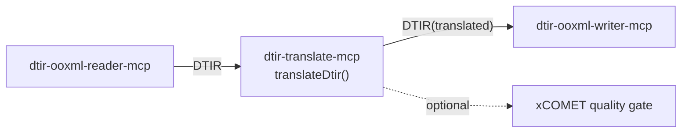

[日本語](./README.md) | **English**

# @shuji-bonji/dtir-translate-mcp

The MCP server for the pipeline's central stage: it fills DTIR's `translation` (and optionally `quality`).
It sits between `dtir-ooxml-reader-mcp` and `dtir-ooxml-writer-mcp`.



## Design essentials

- **Batch translation per group (= source language).** Aggregate into one request **per language**, not per paragraph.
  → The direct answer to the original DeepL Bridges question, "calling per paragraph makes the cost explode."
- **Boundary preservation**: one request is a `text[]` array. Never concatenate. The returned array length must equal the input length (throws if it breaks).
- **Engine-independent**: the `Translator` abstraction. Swappable among `DeeplHttpTranslator` (HTTP, sends arrays per group) /
  `StaticMapTranslator` (pre-translated map) / your own LLM implementation.
- **Quality gate**: the `Evaluator` abstraction (xCOMET). It needs no lang, so only `source`/`translation` are passed.
- `translatable=false` is never touched.

## Real end-to-end (verified)

`test/pipeline-e2e.ts` feeds a translation map obtained from real DeepL (`test/fixtures/real-deepl-map.json`)
and produces a **real translated docx** through reader→translate→writer. Results:

| source (group)                         | translation (en-GB, real DeepL)          | xCOMET |
| -------------------------------------- | ---------------------------------------- | ------ |
| `Jaarverslag 2025` (nl)                | Annual report 2025                       | 1.00   |
| `Les résultats … prévisions.` (fr)     | First-quarter results exceed forecasts.  | 1.00   |
| `Die Produktion … automatisiert.` (de) | Production was fully automated in April. | 0.98   |
| `Inhoudsopgave` (nl)                   | Table of contents                        | 1.00   |
| `Vertrouwelijk` (nl)                   | Confidential                             | 1.00   |
| `Overview 概要` (en)                   | Overview 概要 (treated as en, kanji kept) | 0.98   |

**translated=6 / batchCalls=4** (the 4 groups nl/fr/de/en) — per language, not per paragraph.
xCOMET average 0.993, 0 critical. Artifacts are in `demo/` (docx, pdf, translated.dtir.json).

## Usage

MCP tool `translate_dtir` (engine is DeepL or a cloud/local LLM):

```jsonc
{ "dtirJson": "<reader-output DTIR>", "targetLang": "en-GB", "engine": "llm" }
// → { engine, stats:{translated,batchCalls,evaluated}, dtir:<translation filled> }
```

The engine is chosen by the `engine` argument, or auto-selected from env if omitted (llm if `LLM_MODEL` is set, else deepl):

| engine          | Required env                  | Example                                                                    |
| --------------- | ----------------------------- | -------------------------------------------------------------------------- |
| `deepl`         | `DEEPL_API_KEY`               | —                                                                          |
| `llm` (cloud)   | `LLM_MODEL`                   | `LLM_MODEL=gpt-4o-mini` (default baseUrl=OpenAI, `LLM_API_KEY`)            |
| `llm` (local)   | `LLM_MODEL` + `LLM_BASE_URL`  | `LLM_BASE_URL=http://localhost:11434/v1` (Ollama), `LLM_MODEL=qwen2.5:7b`  |

## Translator implementations (swappable)

| Implementation        | Purpose                                                                            |
| --------------------- | ---------------------------------------------------------------------------------- |
| `DeeplHttpTranslator` | DeepL HTTP (aggregates per group with a `text[]` array)                            |
| `LlmTranslator`       | **OpenAI-compatible** = both cloud and local. Structured output + **length guarantee + retry** |
| `StaticMapTranslator` | Pre-translated map (testing, reproduction)                                         |

```ts
import {
  translateDtir,
  LlmTranslator,
} from '@shuji-bonji/dtir-translate-mcp/translate';
// Local LLM (Ollama) example
const t = new LlmTranslator({
  model: 'qwen2.5:7b',
  baseUrl: 'http://localhost:11434/v1',
});
const { dtir, stats } = await translateDtir(dtir, t, { targetLang: 'en-GB' });
```

`LlmTranslator` handles the fact that LLMs tend to break the item count: it requests `{"translations":[...]}` JSON
and **validates that the returned array length equals the input length, with a corrective retry**. For weaker local
models, combine it with the xCOMET quality gate (the re-translation loop lives in `dtir-docx-pipeline`).

## Connecting as an MCP server

Build (place `doc-translation-ir` next to it **at build time only**; type-only dependency, not needed at runtime):

```sh
git clone https://github.com/shuji-bonji/doc-translation-ir.git
git clone https://github.com/shuji-bonji/dtir-translate-mcp.git
cd dtir-translate-mcp && npm install   # `prepare` auto-builds → dist/index.js (rebuild with npm run build)
```

### Claude Desktop (`claude_desktop_config.json`)

Change `env` to match the translation engine (put API keys **only in this config file**, never in the repo):

```jsonc
{
  "mcpServers": {
    "dtir-translate": {
      "command": "node",
      "args": ["/ABS/PATH/dtir-translate-mcp/dist/index.js"],
      "env": { "DEEPL_API_KEY": "your-deepl-key" },
      // cloud LLM: "env": { "LLM_MODEL": "gpt-4o-mini", "LLM_API_KEY": "sk-..." }
      // local LLM: "env": { "LLM_MODEL": "qwen2.5:7b", "LLM_BASE_URL": "http://localhost:11434/v1" }
    },
  },
}
```

### Claude Code

```sh
# DeepL
claude mcp add --env DEEPL_API_KEY=your-key dtir-translate -- node /ABS/PATH/dtir-translate-mcp/dist/index.js
# cloud LLM
claude mcp add -e LLM_MODEL=gpt-4o-mini -e LLM_API_KEY=sk-... dtir-translate -- node /ABS/PATH/dtir-translate-mcp/dist/index.js
# local LLM (Ollama)
claude mcp add -e LLM_MODEL=qwen2.5:7b -e LLM_BASE_URL=http://localhost:11434/v1 dtir-translate -- node /ABS/PATH/dtir-translate-mcp/dist/index.js
```

Provided tool: **`translate_dtir`** (DTIR → translation-filled DTIR; switch with `engine: deepl|llm`)

## Tests

- `npm test` — vitest (each Translator: DeepL/LLM/Static; aggregation count = number of language groups; boundary preservation;
  throws on length mismatch; the LLM's structured output + retry; quality filling). No real LLM needed (fetch is mocked).

## Notes

- DeepL's official MCP `translate-text` takes a single text input. This package's `DeeplHttpTranslator` uses
  the HTTP API's `text[]` array input to bundle **one request per group**, keeping cost down.
- The DTIR type depends on `@shuji-bonji/doc-translation-ir` (the shared contract).
