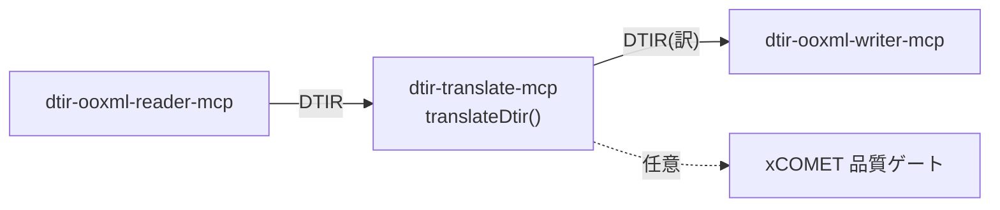

# @shuji-bonji/dtir-translate-mcp

DTIR の `translation`（と任意で `quality`）を埋める、パイプライン中央ステージの MCP サーバ。
`dtir-ooxml-reader-mcp` と `dtir-ooxml-writer-mcp` の間に入る。



## 設計の要

- **group(=source言語) 単位でバッチ翻訳**。段落数ぶんではなく**言語数ぶん**のリクエストに集約。
  → 元の DeepL Bridges 相談「段落ごとに叩くとコスト爆発」への直接の回答。
- **境界保持**: 1リクエストは `text[]` 配列。連結しない。戻り配列長＝入力長を強制（崩れたら例外）。
- **エンジン非依存**: `Translator` 抽象。`DeeplHttpTranslator`（HTTP, group単位で配列送信）/
  `StaticMapTranslator`（事前訳マップ）/ 自作 LLM 実装に差し替え可。
- **品質ゲート**: `Evaluator` 抽象（xCOMET）。lang 不要なので `source`/`translation` だけ渡す。
- `translatable=false` は一切触らない。

## 実機 end-to-end（検証済み）

`test/pipeline-e2e.ts` は、本物の DeepL で取得した訳マップ（`test/fixtures/real-deepl-map.json`）を
流し込み、reader→translate→writer で**本物の訳 docx** を生成する。実行結果:

| source (group) | translation (en-GB, 実DeepL) | xCOMET |
|---|---|---|
| `Jaarverslag 2025` (nl) | Annual report 2025 | 1.00 |
| `Les résultats … prévisions.` (fr) | First-quarter results exceed forecasts. | 1.00 |
| `Die Produktion … automatisiert.` (de) | Production was fully automated in April. | 0.98 |
| `Inhoudsopgave` (nl) | Table of contents | 1.00 |
| `Vertrouwelijk` (nl) | Confidential | 1.00 |
| `Overview 概要` (en) | Overview 概要（en扱いで漢字残存） | 0.98 |

**translated=6 / batchCalls=4**（nl/fr/de/en の4グループ）— 段落数ぶんではなく言語数ぶん。
xCOMET 平均 0.993・critical 0。成果物は `demo/`（docx・pdf・translated.dtir.json）。

## 使い方

MCP tool `translate_dtir`（要 `DEEPL_API_KEY`）:

```jsonc
{ "dtirJson": "<reader 出力 DTIR>", "targetLang": "en-GB" }
// → { stats:{translated,batchCalls,evaluated}, dtir:<translation 充填済> }
```

ライブラリ:

```ts
import { translateDtir, DeeplHttpTranslator } from '@shuji-bonji/dtir-translate-mcp/translate';
const { dtir, stats } = await translateDtir(dtir, new DeeplHttpTranslator(key), { targetLang: 'en-GB' });
```

## テスト

- `npm test` — vitest（バッチ集約数＝言語グループ数 / 境界保持 / 不一致で例外 / 品質充填）
- `npm run test:e2e` — 実 DeepL 訳マップで reader→translate→writer の実 docx 生成

## メモ

- DeepL 公式 MCP の `translate-text` は単一テキスト入力。本パッケージの `DeeplHttpTranslator` は
  HTTP API の `text[]` 配列入力を使い **group 単位で1リクエスト**にまとめてコストを抑える。
- DTIR 型は `src/dtir.ts` にローカル複製（正本は `doc-translation-ir`）。
