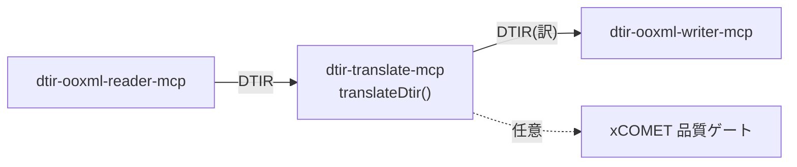

**日本語** | [English](./README.en.md)

# @shuji-bonji/dtir-translate-mcp

DTIR の `translation`（と任意で `quality`）を埋める、パイプライン中央ステージの MCP サーバ。
`dtir-ooxml-reader-mcp` と `dtir-ooxml-writer-mcp` の間に入る。



## 設計の要

- **group(=source言語) 単位でバッチ翻訳**。段落数ぶんではなく**言語数ぶん**のリクエストに集約。
  → 元の DeepL Bridges 相談「段落ごとに叩くとコスト爆発」への直接の回答。
- **境界保持**: 1リクエストは `text[]` 配列。連結しない。戻り配列長＝入力長を強制（崩れたら例外）。
- **エンジン非依存**: `Translator` 抽象。`DeeplHttpTranslator`（HTTP, group単位で配列送信）/
  `StaticMapTranslator`（事前訳マップ）/ 自作 LLM 実装に差し替え可。
- **品質ゲート**: `Evaluator` 抽象（xCOMET）。lang 不要なので `source`/`translation` だけ渡す。
- `translatable=false` は一切触らない。

## 実機 end-to-end（検証済み）

`test/pipeline-e2e.ts` は、本物の DeepL で取得した訳マップ（`test/fixtures/real-deepl-map.json`）を
流し込み、reader→translate→writer で**本物の訳 docx** を生成する。実行結果:

| source (group)                         | translation (en-GB, 実DeepL)             | xCOMET |
| -------------------------------------- | ---------------------------------------- | ------ |
| `Jaarverslag 2025` (nl)                | Annual report 2025                       | 1.00   |
| `Les résultats … prévisions.` (fr)     | First-quarter results exceed forecasts.  | 1.00   |
| `Die Produktion … automatisiert.` (de) | Production was fully automated in April. | 0.98   |
| `Inhoudsopgave` (nl)                   | Table of contents                        | 1.00   |
| `Vertrouwelijk` (nl)                   | Confidential                             | 1.00   |
| `Overview 概要` (en)                   | Overview 概要（en扱いで漢字残存）        | 0.98   |

**translated=6 / batchCalls=4**（nl/fr/de/en の4グループ）— 段落数ぶんではなく言語数ぶん。
xCOMET 平均 0.993・critical 0。成果物は `demo/`（docx・pdf・translated.dtir.json）。

## 使い方

MCP tool `translate_dtir`（エンジンは DeepL かクラウド/ローカル LLM）:

```jsonc
{ "dtirJson": "<reader 出力 DTIR>", "targetLang": "en-GB", "engine": "llm" }
// → { engine, stats:{translated,batchCalls,evaluated}, dtir:<translation 充填済> }
```

エンジンは `engine` 引数、無ければ env で自動選択（`LLM_MODEL` があれば llm、なければ deepl）:

| engine            | 必要 env                    | 例                                                                         |
| ----------------- | --------------------------- | -------------------------------------------------------------------------- |
| `deepl`           | `DEEPL_API_KEY`             | —                                                                          |
| `llm`（クラウド） | `LLM_MODEL`                 | `LLM_MODEL=gpt-4o-mini`（既定 baseUrl=OpenAI, `LLM_API_KEY`）              |
| `llm`（ローカル） | `LLM_MODEL`＋`LLM_BASE_URL` | `LLM_BASE_URL=http://localhost:11434/v1`（Ollama）, `LLM_MODEL=qwen2.5:7b` |

## Translator 実装（差し替え可）

| 実装                  | 用途                                                                           |
| --------------------- | ------------------------------------------------------------------------------ |
| `DeeplHttpTranslator` | DeepL HTTP（`text[]` 配列で group 単位集約）                                   |
| `LlmTranslator`       | **OpenAI 互換**＝クラウド/ローカル両対応。構造化出力＋**配列長保証＋リトライ** |
| `StaticMapTranslator` | 事前訳マップ（テスト・再現）                                                   |

```ts
import {
  translateDtir,
  LlmTranslator,
} from '@shuji-bonji/dtir-translate-mcp/translate';
// ローカル LLM（Ollama）例
const t = new LlmTranslator({
  model: 'qwen2.5:7b',
  baseUrl: 'http://localhost:11434/v1',
});
const { dtir, stats } = await translateDtir(dtir, t, { targetLang: 'en-GB' });
```

`LlmTranslator` は LLM が件数を崩しがちな点に対応し、`{"translations":[...]}` の JSON を要求して
**戻り配列長＝入力長を検証・是正リトライ**する。ローカルの弱いモデルでは xCOMET 品質ゲートと
組み合わせる（再翻訳ループは `dtir-docx-pipeline` 側）。

## MCP サーバとして接続

ビルド（**build 時だけ** `doc-translation-ir` を隣に置く。実行時は型のみ依存で不要）:

```sh
git clone https://github.com/shuji-bonji/doc-translation-ir.git
git clone https://github.com/shuji-bonji/dtir-translate-mcp.git
cd dtir-translate-mcp && npm install   # prepare で自動ビルド → dist/index.js（再ビルドは npm run build）
```

### Claude Desktop（`claude_desktop_config.json`）

翻訳エンジンに応じて `env` を変える（API キーは**この設定ファイルにのみ**置き、リポジトリには入れない）:

```jsonc
{
  "mcpServers": {
    "dtir-translate": {
      "command": "node",
      "args": ["/ABS/PATH/dtir-translate-mcp/dist/index.js"],
      "env": { "DEEPL_API_KEY": "your-deepl-key" },
      // クラウドLLM: "env": { "LLM_MODEL": "gpt-4o-mini", "LLM_API_KEY": "sk-..." }
      // ローカルLLM: "env": { "LLM_MODEL": "qwen2.5:7b", "LLM_BASE_URL": "http://localhost:11434/v1" }
    },
  },
}
```

### Claude Code

```sh
# DeepL
claude mcp add --env DEEPL_API_KEY=your-key dtir-translate -- node /ABS/PATH/dtir-translate-mcp/dist/index.js
# クラウドLLM
claude mcp add -e LLM_MODEL=gpt-4o-mini -e LLM_API_KEY=sk-... dtir-translate -- node /ABS/PATH/dtir-translate-mcp/dist/index.js
# ローカルLLM（Ollama）
claude mcp add -e LLM_MODEL=qwen2.5:7b -e LLM_BASE_URL=http://localhost:11434/v1 dtir-translate -- node /ABS/PATH/dtir-translate-mcp/dist/index.js
```

提供ツール: **`translate_dtir`**（DTIR → 翻訳充填済み DTIR。`engine: deepl|llm` で切替）

## テスト

- `npm test` — vitest（DeepL/LLM/Static 各 Translator、バッチ集約数＝言語グループ数、境界保持、
  長さ不一致で例外、LLM の構造化出力＋リトライ、品質充填）。実 LLM は不要（fetch をモック）。

## メモ

- DeepL 公式 MCP の `translate-text` は単一テキスト入力。本パッケージの `DeeplHttpTranslator` は
  HTTP API の `text[]` 配列入力を使い **group 単位で1リクエスト**にまとめてコストを抑える。
- DTIR 型は `@shuji-bonji/doc-translation-ir` に依存（共有契約）。
